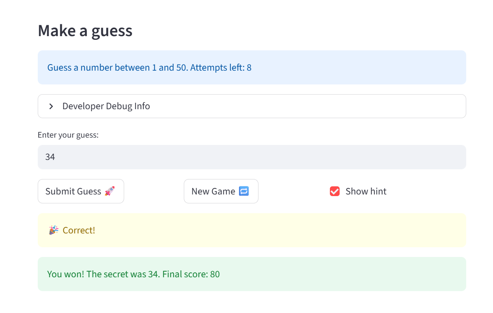

# 🎮 Game Glitch Investigator: The Impossible Guesser

## 🚨 The Situation

You asked an AI to build a simple "Number Guessing Game" using Streamlit.
It wrote the code, ran away, and now the game is unplayable. 

- You can't win.
- The hints lie to you.
- The secret number seems to have commitment issues.

## 🛠️ Setup

1. Install dependencies: `pip install -r requirements.txt`
2. Run the broken app: `python -m streamlit run app.py`

## 🕵️‍♂️ Your Mission

1. **Play the game.** Open the "Developer Debug Info" tab in the app to see the secret number. Try to win.
2. **Find the State Bug.** Why does the secret number change every time you click "Submit"? Ask ChatGPT: *"How do I keep a variable from resetting in Streamlit when I click a button?"*
3. **Fix the Logic.** The hints ("Higher/Lower") are wrong. Fix them.
4. **Refactor & Test.** - Move the logic into `logic_utils.py`.
   - Run `pytest` in your terminal.
   - Keep fixing until all tests pass!

## 📝 Document Your Experience

- [ ] Describe the game's purpose.
   It's a number guessing game where the app picks a secret number and you have a limited number of attempts to guess it. After each guess it tells you if you went too high or too low, and your final score is based on how few attempts it took you to find the correct number.
- [ ] Detail which bugs you found.
   -Backwards hints — when a guess was too high the game said "Go HIGHER" and vice versa. Fixed by swapping the return messages in check_guess.
   -New Game button didn't restart — clicking New Game after winning or losing kept showing "Game over" / "You already won" because status was never reset. 
   -Wrong difficulty ranges — Normal had range 1–100 (harder than Hard's 1–50).
   -Even-attempt string conversion — at every even-numbered attempt, the secret was cast to a string with str(st.session_state.secret), making a correct integer guess never match, and causing a TypeError crash on non-equal guesses.
- [ ] Explain what fixes you applied.
   -Fixed by swapping the return messages in check_guess
   -Fixed by adding st.session_state.status = "playing" to the new game handler.
   -Fixed by correcting get_range_for_difficulty to Easy=1–20, Normal=1–50, Hard=1–100.
   -Fixed by removing the even/odd branch entirely.

## 📸 Demo

- [ ] [Insert a screenshot of your fixed, winning game here]

## 🚀 Stretch Features

- [ ] [If you choose to complete Challenge 4, insert a screenshot of your Enhanced Game UI here]
